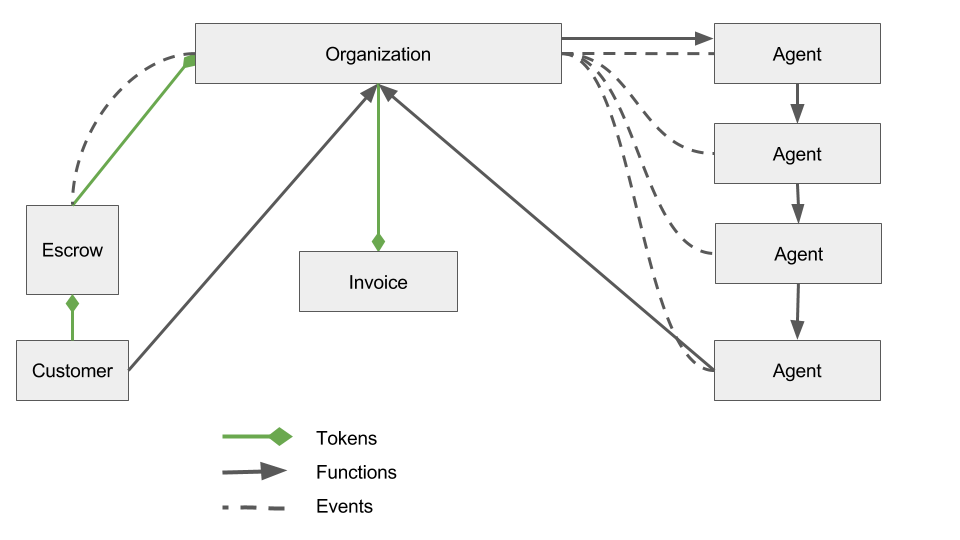

# SingularityNET
Smart contract design

### Contracts

* AGI Token
* RoboToken (also T-Coin or Spikes)
* MarketJob
* Agent
* AgentFactory
* AgentRegistry

### Actors
* Customer
* Job
* Agent(s) (multiple services for each)
* Token

### Customer Flow
1) Customer request a job  
2) An off-chain estimation happens on the customer's request
3) Finds service providers trought AgentRegistry
4) Contact an Agent and append a Job (he becomes the agent master)
5) The master agent create a MarketJob contract with payer and payee
6) Once th job is done the tokens are swapped from customer's account to agent master 

### Agent Flow
1) Start Agent  
2) Register the service(s) into the Registry    
4) a new event  triggered new Packet Appended based on the Registry mapping  
5) The Agent(s) complete the job and signals marketJob
6) The tokens are automaticcaly swapped 
7) Create a pull mecahnism for sub-agent to withdrawal funds from master agent  

### Agent (pseudo)API 

To make your app work on Ethereum, you can use the web3 object provided by the web3 (python library). Under the hood it communicates to a local node through RPC calls. web3 works with any Ethereum node, which exposes an RPC layer.

### Methods

* joinNetwork() : address
* advertiseService(uint id, address) : void
* findServiceProviders(uint service) : uint[]
* getAgentbyId(uint id) : address

### Events 

[web3.py Events doc](https://web3py.readthedocs.io/en/latest/contracts.html#events)
* AgentAdded(uint id, address agent)
* Deposited(address from, uint value)